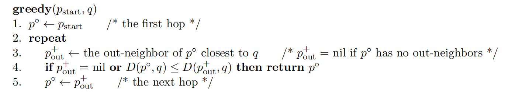
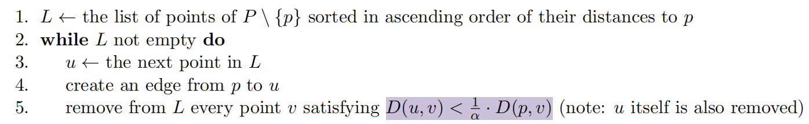

# 【NOTE 1】Proximity Graph

## (1.1) 基础定义 (Preliminaries)

### (1.1.1) 度量空间 (Metric Space)
我们考虑一个度量空间 $(\mathcal{M}, D)$，其中：
*   $\mathcal{M}$ 是一个（可能无限的）点集。
*   $D$ 是一个距离函数，给定任意两点 $p_1, p_2 \in \mathcal{M}$，可以在常数时间内计算出非负实数距离 $D(p_1, p_2)$。

**距离函数 $D$ 满足以下性质：**

1.  **不可区分者的同一性 (Identity of indiscernibles):** $D(p_1, p_2) = 0$ 当且仅当 $p_1 = p_2$；
2.  **对称性 (Symmetry):** $D(p_1, p_2) = D(p_2, p_1)$；
3.  **三角不等式 (Triangle inequality):** $D(p_1, p_2) \leq D(p_1, p_3) + D(p_2, p_3)$；

### (1.1.2) 最近邻与近似最近邻
令 $P$ 为从 $\mathcal{M}$ 中选取的 $n \ge 2$ 个点的集合，称为 **Data Points**（数据点）。给定一个查询点 $q \in \mathcal{M}$：

*   **Nearest Neighbor (NN):** 点 $p^* \in P$ 是 $q$ 的 NN，如果对所有 $p \in P$ 都满足 $D(p^*, q) \leq D(p, q)$；
*   **(1 + $\epsilon$)-Approximate Nearest Neighbor (ANN):** 给定值 $\epsilon > 0$，点 $p \in P$ 是 $q$ 的 $(1+\epsilon)$-ANN，如果满足：$D(p, q) \leq (1 + \epsilon) \cdot D(p^*, q)$；

> **本 Lecture 的目标：** 在数据集 $P$ 上构建数据结构，以便能够比暴力搜索 $O(n)$ 更快地找到任意查询点 $q$ 的 $(1+\epsilon)$-ANN。

---

## (1.2) 邻近图 (Proximity Graphs)

考虑一个简单的有向图 $G$，其中 $P$ 中的每个点对应 $G$ 中的一个顶点。

### (1.2.1) 定义
图 $G$ 被称为 **$(1 + \epsilon)$-proximity graph (PG)**，如果对于任意查询点 $q \in \mathcal{M}$ 和任意起始数据点 $p_{\text{start}} \in P$，以下 `greedy search` 算法总是返回 $q$ 的一个 $(1 + \epsilon)$-ANN。

### (1.2.2) Greedy Search 算法

> **注：** 在算法执行过程中，访问到的 hop vertices 序列到 $q$ 的距离是严格递减的。

---

## (1.3) 可导航性 (Navigability)

我们需要一个条件来判断图 $G$ 是否是一个合格的 Proximity Graph。下面我们介绍一种 Proximity Graph 的等价描述，称为 **$(1 + \epsilon)$-navigability**。

### (1.3.1) 定义
图 $G$ 被称为 **$(1 + \epsilon)$-navigable**，如果对于每个数据点 $p \in P$ 和每个查询点 $q \in \mathcal{M}$，满足以下两个条件之一：
*   $p$ 已经是 $q$ 的 $(1 + \epsilon)$-ANN；
*   或者 $p$ 拥有一个出邻居 $p_{\text{out}}$，满足 $D(p_{\text{out}}, q) < D(p, q)$ (即存在更近的邻居)。

### (1.3.2) Lemma 1: $(1+\epsilon)$-PG 与 $(1+\epsilon)$-Navigability 的等价性
**结论：** $G$ 是 $P$ 的 $(1 + \epsilon)$-PG 当且仅当 $G$ 是 $(1 + \epsilon)$-navigable 的。

**证明如下：**

*   **($\Leftarrow$ 方向):** 如果 $G$ 是 $(1 + \epsilon)$-navigable 的，假设运行在 $G$ 上的 Greedy 算法最终返回了一个顶点 $p$，假设 $p$ 不是 $(1 + \epsilon)$-ANN。那么，根据 $(1 + \epsilon)$-navigable 的定义，顶点 $p$ 一定存在一个出邻居 $p_{\text{out}}$，满足 $D(p_{\text{out}}, q) < D(p, q)$，因此 Greedy 算法不会停止在顶点 $p$，而是会通过这个邻居 $p_{out}$ 执行下去，与 $p$ 不是 $(1 + \epsilon)$-ANN 的假设矛盾。因此，Greedy 算法返回的顶点一定是 $(1 + \epsilon)$-ANN。
*   **($\Rightarrow$ 方向):** 如果 $G$ 是 $(1 + \epsilon)$-PG，给定一个查询点 $q$，考虑一个点 $p$ 不是查询点 $q$ 的 $(1 + \epsilon)$-ANN 的情况。我们运行一个从 $p$ 出发的 Greedy 算法，算法最终会到达一个 $(1 + \epsilon)$-ANN，因此必然不能直接返回 $p$；这意味着 $p$ 必须有一个出邻居 $p_{\text{out}}$，满足 $D(p_{\text{out}}, q) < D(p, q)$，以支持 Greedy 算法的继续运行。因此，$G$ 是 $(1 + \epsilon)$-navigable 的。

---

## (1.4) DiskANN 算法

本节介绍一种构建 Proximity Graph 的方法，称为 **DiskANN** [NeurIPS 2019]。我们会介绍这种 Proximity Graph 的构建算法，并证明它是 $(1 + \epsilon)$-navigable 的。

### (1.4.1) 建图算法
对于每个点 $p$，DiskANN 通过以下步骤计算其出边：

这个建图算法基于一个很直观的 ituition，假设顶点 $p$ 代表城市新加坡，顶点 $u,v$ 分别代表城市纽约和波士顿，如果纽约和波士顿之间足够近，那么同时保留新加坡到纽约和波士顿的航线是冗余的，因此我们只需要保留新加坡到更近的纽约的航线即可。

### (1.4.2) The Shortcut Property 
The Shortcut Property 是指，对于任意点 $v \in P \setminus \{p\}$，以下两者至少其一成立：

*   $v$ 是 $p$ 的直接出邻居；
*   $p$ 有一个出邻居 $p_{\text{out}}$，满足 $ D(p_{\text{out}}, v) < \frac{1}{\alpha} \cdot D(p, v) $。

> 这里的 $\alpha$ 的取值为 $\alpha = 1 + \frac{4}{\epsilon}$，我们会在下文讨论这个取值。
>

很显然，上述 DiskANN 建图算法保证了 Shortcut Property 的成立。

### (1.4.3) Lemma 2: DiskANN 是 $(1+\epsilon)$-Navigable 的
**结论：** DiskANN 生成的图 $G_{\text{DA}}$ 是 **$(1 + \epsilon)$-Navigable** 的。(因此 $G_{\text{DA}}$ 也是 $(1+\epsilon)$-PG)。

**证明：**

考虑一个查询点 $q\in \mathcal{M}$，以及任意一个数据点 $p \in P$，我们假设当前，在 $G_{DA}$ 的 Greedy 算法已经搜索到了顶点 $p$。

那么，如果 $p$ 已经是 $q$ 的一个 $(1+\epsilon)$-ANN，则满足 $(1+\epsilon)$-Navigability 的定义。下面，我们考虑 $p$ 不是 $q$ 的 $(1+\epsilon)$-ANN 的情况：

根据 **$(1+\epsilon)$-navigability** 的定义，我们需要证明 $p$ 有一个出邻居 $p_{\text{out}}$ 使得 $D(p_{\text{out}}, q) < D(p, q)$。

我们令 $p^*$ 为 $q$ 的精确 Nearest Neighbor。我们需要证明 $p$ 有一个出邻居 $p_{\text{out}}$ 使得 $D(p_{\text{out}}, q) < D(p, q)$。

1.  如果 $p^*$ 是 $p$ 的直接邻居，由 $p$ 不是  $(1+\epsilon)$-ANN 可知 $D(p, q) > (1+\epsilon)D(p^*, q) > D(p^*, q)$，证毕。
2.  如果 $p^*$ 不是 $p$ 的直接邻居，根据 Shortcut Property，点 $p$ 存在邻居 $p_{\text{out}}$ 满足 $D(p_{\text{out}}, p^*) < \frac{1}{\alpha} D(p, p^*)$。

利用三角不等式推导：
$$
\begin{aligned}
D(p_{\text{out}}, q) &\leq D(p_{\text{out}}, p^*) + D(p^*, q) \\
&< \frac{D(p, p^*)}{\alpha} + D(p^*, q) \\
&\leq \frac{D(p, q) + D(p^*, q)}{\alpha} + D(p^*, q) \\
& = \frac{D(p, q)}{\alpha} + \left(1 + \frac{1}{\alpha}\right) D(p^*, q) \\
\end{aligned}
$$
考虑到 $p$ 不是 $(1+\epsilon)-$ANN，我们有 $D(p,q) > (1+\epsilon)\cdot D(p^{*},q)$，继续推导：
$$
\begin{aligned}
D(p_{\text{out}}, q) &< \frac{D(p,q)}{\alpha} + \frac{D(p,q)}{1+\epsilon}\cdot(1+\frac{1}{\alpha}) \\
&= D(p,q) \cdot \left(\frac{1}{\alpha} + \frac{1}{1+\epsilon}\cdot \left(1+\frac{1}{\alpha}\right)\right) \\
\end{aligned}
$$
我们希望把括号里面的系数构造成 $\epsilon$，因此取参数 $\alpha = 1 + \frac{4}{\epsilon}$，则有下式成立，证毕。$\square$
$$
D(p_{\text{out}},q) < \epsilon \cdot D(p,q)
$$

> Reference: [1] Suhas Jayaram Subramanya et al. "DiskANN: Fast accurate billion-point nearest neighbor search on a single node." *NeurIPS*, 2019.

---

