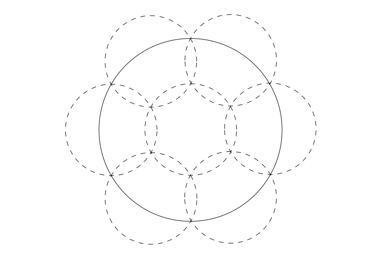

# 【NOTE 2】Doubling Dimension

---

在上文，我们已经理解了为什么 DiskANN 在 $(1+\epsilon)$-ANN Search 问题上是一个 work 的方法。接下来，我们将研究这个 PG 在搜索性能上的性质。我们将分步实现这个目标。首先，我们先分析 DiskANN 构建的 Proximity Graph 的大小（即边数）。

## (2.1) 倍增维数 (Doubling Dimension)

在分析 ANN 搜索方法（如 DiskANN）的性能之前，我们需要引入一些关于度量空间内在维度的概念，作为我们分析和证明的工具。

我们需要量化度量空间 $(\mathcal{M}, D)$ 的“内在维度”（Intrinsic Dimensionality）。本节介绍一个用于衡量 Intrinsic Dimensionality 的概念——**Doubling Dimension**。

### (2.1.1) 定义：球 (Ball) 

给定点 $p \in \mathcal{M}$ 和实数值 $r \ge 0$，定义：
$$
B(p, r) = \{q \in \mathcal{M} \mid D(p, q) \le r\}
$$
我们将 $B(p, r)$ 称为以 $p$ 为中心、半径为 $r$ 的**球 (Ball)**。

### (2.1.2) 定义：Doubling Dimension

度量空间 $(\mathcal{M}, D)$ 的 **Doubling Dimension** 是满足以下条件的最小实数值 $\lambda \ge 0$：

对于任意 $p \in \mathcal{M}$ 和任意 $r \ge 0$，球 $B(p, r)$ 可以被至多 $2^\lambda$ 个半径为 $r/2$ 的球覆盖。即，存在 $t \le 2^\lambda$ 个点 $p_1, p_2, \dots, p_t \in \mathcal{M}$，使得：

$$
B(p, r) \subseteq \bigcup_{i=1}^{t} B(p_i, r/2)
$$

### (2.1.3) 示例 (Examples)

1.  **一维实数空间 ($\mathcal{M} = \mathbb{R}$):** 我们定义实数空间的距离为 $D(x, y) = |x - y|$。则球 $B(p, r)$ 是区间 $[p-r, p+r]$。显然，该区间可以被 2 个半径为 $r/2$ 的“球”（其实是长度为 $r$ 的区间）覆盖（$[p-r, p]$ 和 $[p, p+r]$）。并且无法仅用 1 个半径为 $r/2$ 的“球”覆盖，所以 $\lambda = 1$（因为 $2^1=2$）。
2.  **二维欧几里得空间 ($\mathcal{M} = \mathbb{R}^2$):** 如下图所示，一个半径为 $r$ 的圆可以被 7 个半径为 $r/2$ 的小圆覆盖（用 6 个小圆无法覆盖，这里我们略去这点的证明）。因此，其 Doubling Dimension 为 $\log_2 7$。

​		

### (2.1.4) Lamma 3：Doubling Dimension 的上下界

在**高维空间 ($\mathcal{M} = \mathbb{R}^d$)**中，我们有如下定理成立：

对于任意整数 $d \ge 1$，$(\mathbb{R}^d, L_t)$ 的 Doubling Dimension $\lambda$ 满足 $d \le \lambda \le c \cdot d$，其中 $c$ 是一个不依赖于 $d$ 或 $t$ 的常数。

本文的内容将用到这个结论，但这个结论的证明超出了本文的范围，因此这里我们略去它的证明，感兴趣的读者可以参考相关文献。

---

## (2.2) 覆盖引理与 Aspect Ratio 引理 (Covering & Aspect Ratio Lemmas)

在本节，我们将介绍两个重要的引理（The Covering Lemma 和 The Aspect Ratio Lemma），这些引理将在后续分析 DiskANN 边数时发挥关键作用。

### (2.2.1) Lemma 4: The Covering Lemma

The Covering Lemma 实际上是 Doubling Dimension 定义的一个推广。回忆一下 Doubling Dimension，它试图用 $2^\lambda$ 个半径为 $r/2$ 的球来覆盖一个半径为 $r$ 的球。而 The Covering Lemma 则进一步将情形推广到更小（当然也更多）的小球，这些小球的半径为任意的 $r/2^k$。

**The Covering Lemma**：令 $(\mathcal{M}, D)$ 为一个 Doubling Dimension 为 $\lambda$ 的度量空间。则对于任意 $p \in \mathcal{M}$ 和 $r > 0$，球 $B(p, r)$ 可以被 $2^{k \cdot \lambda}$ 个半径为 $r/2^k$ 的球覆盖（对于任意整数 $k \ge 0$）。

对该定理的证明，我们对整数 $k$ 采用归纳法：

**Base case:** 对于 $k=0$ 的情形，其实就是 Doubling Dimension 的定义，显然成立。

**Inductive step:** 假设 $B(p, r)$ 能被 $2^{i \cdot \lambda}$ 个半径为 $r/2^i$ 的球覆盖。下面我们证明 $B(p, r)$ 也能被 $2^{(i+1) \cdot \lambda}$ 个半径为 $r/2^{i+1}$ 的球覆盖。

考虑每一个覆盖 $B(p, r)$ 的半径为 $r/2^i$ 的小球。根据 Doubling Dimension 的定义，每一个这样的小球又可以被 $2^\lambda$ 个半径为 $r/2^{i+1}$ 的球覆盖。因此，总共需要的半径为 $r/2^{i+1}$ 的球的数量为：$2^{i\cdot \lambda} \cdot 2^{\lambda} = 2^{(i+1)\cdot\lambda}$；证毕。

因此，The Covering Lemma 得证。

### (2.2.2) Aspect Ratio 定义

给定 $\mathcal{M}$ 中的点集 $X$，定义其 **Aspect Ratio** $A$ 为：
$$
A = \frac{d_{\max}}{d_{\min}}
$$
其中 $D_{\min}$ 和 $D_{\max}$ 分别是点集 $X$ 中点对之间的**最小**和**最大**距离。值得一提的是，$D_{\max}$ 也被称为 $X$ 的**直径 (Diameter)**。

### (2.2.3) Lemma 5: The Aspect Ratio Lemma

这个引理给出了点集大小与其 Aspect Ratio（$A$）、倍增系数（Doubling Dimension, $\lambda$）之间的关系。定理如下：

点集 $X$ 的大小满足 $|X| \le (8A)^\lambda$。

我们证明这个定理的思路是使用 The Covering Lemma 搭建 $D_{\max}$ 和 $D_{\min}$ 之间的关系，**证明如下：**

令 $k = 2 + \lceil \log_2 A \rceil$。由此可得：
$$
\frac{d_{\max}}{2^k} = \frac{A \cdot d_{\min}}{2^k} < \frac{d_{\min}}{2}
$$

> 第二个小于号成立是因为 $2^k \ge 2^{2 + \log_2 A} = 4A$。

我们可以认为，整个集合 $X$ 包含在一个半径为 $D_{\max}$ 的球 $B(p, D_{\max})$ 中（$p \in X$）。考虑我们上文证明的 The Covering Lemma，我们可以用半径为 $D_{\max}/2^k$ 的小球来覆盖 $B(p, D_{\max})$，从而覆盖 $X$。那么，我们需要的小球数量是 $2^{k\cdot\lambda}$ 个，这个数量的上界是：
$$
2^{k\lambda} \le 2^{\lambda(3 + \log_2 A)} = (2^{3 + \log_2 A})^\lambda = (8A)^\lambda
$$
由于我们使用的小球的半径为 $D_{\max}/2^k < D_{\min}/2$，所以，当我们使用大小为 $D_{\min}/2$ 的小球覆盖 $X$ 时，所需的小球数量也不会超过 $(8A)^\lambda$。

更精妙的一点在于，这些小球实际上**每个只能包含 $X$ 中的 1 个点**。这是因为：

这些小球的半径小于 $D_{\min}/2$，其内部任意两点的距离必定小于 $D_{\min}$。然而，$X$ 中任意两点的距离至少为 $D_{\min}$。因此，每个小球至多包含 $X$ 中的 **1个** 点。所以 $|X|$ 不超过小球的总数 $(8A)^\lambda$。The Aspect Ratio Lemma 证毕。

---

## (2.3) DiskANN 边数的上界分析

读者可以返回（1.4）DiskANN 算法复习一下 DiskANN 构建 Proximity Graph 的过程。在本节中，我们要分析 DiskANN 构建的 $(1+\epsilon)$-PG（记为 $G_{DA}$）的大小（即边数）。
考虑 $(\mathcal{M}, D)$ 为一个 Doubling Dimension 为 $\lambda$ 的度量空间。令 $P$ 为输入点集，$n = |P|$，且 $\alpha = 1 + 4/\epsilon$（和之前我们介绍的 setting 一样）。

> 为简化讨论，我们假设 $\alpha$ 是 2 的幂。

### (2.3.1) Lemma 6：Donut 区域的邻居距离下界

在本节，我们先把注意力放到 $S = B(p,r)\backslash B(p,r/2)$，即以 $p$ 为中心、半径在 $[r/2, r]$ 之间的“Donut”（甜甜圈）区域。固定 $r > 0$。定义“Donut”区域 $S = B(p, r) \setminus B(p, r/2)$。令 $p_1, p_2$ 为 $S \cap P$ 中的两点，且满足：
$$
D(p_1, p_2) \le \frac{r}{2\alpha}
$$
那么，$p_1$ 和 $p_2$ 中**至多只有一个**能成为 $p$ 的出邻居。

> “Donut”区域 $S$ 指的是以 $p$ 为中心、半径在 $[r/2, r]$ 之间的区域。形状像一个甜甜圈。

我们给出证明如下：

由 $p_1, p_2 \in S$ 可知 $D(p, p_1) > r/2$ 且 $D(p, p_2) > r/2$，不失一般性地，我们假设 $D(p,p_1) \le D(p,p_2)$，即 $p_1$ 在列表 $L$ 中排在 $p_2$ 前面。

如果 $p_1$ 不是 $p$ 的出邻居，那么结论显然成立；所以我们只需要考虑 $p_1$ 已经是 $p$ 的出邻居的情形。下面我们证明，当 $p_1$ 成为了 $p$ 的出邻居后，$p_2$ 一定会被剪枝掉。

由于 $p_1,p_2$ 之间的距离 $D(p_1,p_2)$ 满足（下式使用了 $r/2 < D(p, p_2)$）：
$$
D(p_1, p_2) \le \frac{r}{2\alpha} < \frac{1}{\alpha} \cdot \frac{r}{2} < \frac{1}{\alpha} \cdot D(p, p_2)
$$
这个不等式实际上就是 DiskANN 算法中的剪枝条件，因此 $p_2$ 会被从列表 $L$ 中移除，无法成为 $p$ 的邻居。

> 这个定理（Lemma 6）事实上可以这样翻译：对于 $p$ 的出邻居点集（表示为 $N_{\text{out}}(p)$），在 “Donut”区域 $S=B(p, r) \setminus B(p, r/2)$ 内的点之间，任意两点的距离都必须大于 $\frac{r}{2\alpha}$。 也就是说，球心在区域 $S$ 内，且半径为 $\frac{r}{4\alpha}$ 的一个小球内，**最多只能包含 1 个** $p$ 的出邻居点。

### (2.3.2) Lemma 7：Donut 区域的邻居数量上界

我们继续观察“Donut”区域 $S = B(p, r) \setminus B(p, r/2)$。下面，我们希望证明，一个顶点在该区域内的邻居数量是有一个严格上界的。

**定理：**对于一个给定的 $r > 0$。定义 $S = B(p, r) \setminus B(p, r/2)$。点 $p$ 在区域 $S \cap P$ 中至多有 $(4\alpha)^\lambda$ 个出邻居。

**证明：**

首先，根据 The Covering Lemma，我们可以得到球 $B(p, r)$ 可以被 $(4\alpha)^\lambda$ 个半径为 $\frac{r}{4\alpha}$ 的小球覆盖。（注意在上文，我们为了简化，已经假设了 $\alpha$ 是 2 的幂）；

并且，根据 Lemma 6，我们已经证明了，在这个球心在区域 $S$ 内，且半径为 $\frac{r}{4\alpha}$ 的小球内，**最多只能包含 1 个** $p$ 的出邻居点。

那么，结合这两点，我们很容易就能得到，$p$ 在 $S \cap P$ 中的出邻居数量不超过小球的数量 $(4\alpha)^\lambda$。

### (2.3.3) Lemma 8: DiskANN 边数复杂度

这里，我们正式给出关于 DiskANN 的边数复杂度的推论（i.e. 在 DiskANN 算法构建的图 $G_{DA}$ 中每个顶点至多会有多少条边）：

令 $\Delta$ 为点集 $P$ 的纵横比 (Aspect Ratio，i.e. $D_{\max} / D_{\min}$)。**结论：** $P$ 中每个点 $p$ 拥有的出边数量为 $O\left((4\alpha)^\lambda \cdot \log_2 \Delta\right)$。

**证明**：

回顾我们上面证明的所有引理，我们研究了一个形状类似甜甜圈的“Donut”区域 $S=B(p, r) \setminus B(p, r/2)$，并且证明了在该区域内 $p$ 的出邻居数量有上界 $(4\alpha)^\lambda$。

考虑一个顶点的邻居分布在广泛的空间中，我们可以将空间划分为若干个这样的“Donut”区域，每个区域的半径是前一个区域的一半。具体来说，我们可以考虑一系列的“Donut”区域：最大的一个 Donut 区域为 $S_1 = B(p, D_{\max}) \setminus B(p, D_{\max}/2)$，第二大的 Donut 区域为 $S_2 = B(p, D_{\max}/2) \setminus B(p, D_{\max}/4)$，最小的 Donut 区域为 $S_k = B(p, D_{\min} \cdot 2) \setminus B(p, D_{\min})$，其中 $k = \lceil \log_2 \Delta \rceil$。

这样，我们有：
$$
\left| N_{out}(p) \right| = \sum_{i=1}^k \left| N_{out}(p) \cap S_i \right| = \sum_{i=1}^k O\left((4\alpha)^\lambda\right) = O\left((4\alpha)^\lambda \cdot \log_2 \Delta\right)
$$
其中 $N_{out}(p)$ 表示 $p$ 的出邻居点集。该推论得证。$\square$

考虑到 $\alpha = O(1/\epsilon)$，上述时间复杂度等价地写作：$O((1/\epsilon)^\lambda \cdot \log \Delta)$。

---

