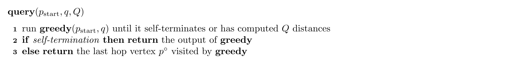

# 【NOTE 3】Query Time of DISKANN

---

在上文（NOTE 2）中，我们分析了 DiskANN 构建的图的大小（边数），通过引入 Doubling Dimension 和 Aspect Ratio 的概念，证明了图的度数上界。

然而，并不是所有的 Proximity Graph (PG) 都是高效的。例如，考虑一维空间 $\mathbb{R}$ 中的点集 $P$。如果我们按升序对点进行排序，并将每两个相邻的点进行双向连接，我们确实得到了一个 PG。你可以验证，在这个图上进行贪婪搜索（Greedy Search）可以找到任意查询 $q$ 的**精确**最近邻。但是，这个图并不保证快速的查询时间。在最坏的情况下，你可能需要遍历所有数据。

在本节，我们将形式化 Proximity Graphs 的“查询时间 (Query Time)”概念，并利用这个概念证明 DiskANN 能够保证一个可证明的、较小的查询时间。

## (3.1) 定义：查询时间 (Query Time)

令 $(\mathcal{M}, D)$ 为一个度量空间，$P \subseteq \mathcal{M}$ 为其中的点集。令 $G$ 为 $P$ 上的一个 $(1+\epsilon)$-PG，这意味着给定任意查询点 $q \in \mathcal{M}$ 和任意起始数据点 $p_{\text{start}} \in P$，**Greedy** 算法总是能返回 $q$ 的一个 $(1+\epsilon)$-ANN。

> 建议读者返回第一节重温一下 **Greedy** 算法的伪代码。

在这里，我们进一步定义查询时间 $Q$，首先我们定义基于查询时间 $Q$ 的 **Greedy** 算法：

有了上述“基于查询时间 $Q$ 的 Greedy 算法”，我们可以定义查询时间 $Q$：

我们认为，一个 Proximity Graph $G$ 能够保证查询时间 $Q$ ，如果它满足：上述算法在任意查询点 $q \in \mathcal{M}$ 和任意起始点 $p_{\text{start}} \in P$ 下，都能（在 $Q$ 次距离计算内）返回 $q$ 的一个 $(1+\epsilon)$-ANN。

## (3.2) DiskANN 的查询复杂度

令 $G_{\text{DA}}$ 为 DiskANN 在点集 $P$ 上构建的 Proximity Graph。我们已知 $G_{\text{DA}}$ 具有 **Shortcut Property**，即对于任意点 $v \in P \setminus \{p\}$，以下两者至少有一个成立：1. $v$ 是 $p$ 的出邻居；2. $p$ 有一个出邻居 $u$ 满足 $ D(u, v) < \frac{1}{\alpha} \cdot D(p, v) $，其中 $\alpha = 1 + 4/\epsilon$。

另外，令 $d_{\min}$ 和 $D_{\max}$ 分别为 $P$ 中最小和最大的点间距离。令 $\Delta$ 为 $P$ 的 **Aspect Ratio (纵横比)**：$\Delta = \frac{D_{\max}}{d_{\min}}$。同时，我们假设 $(\mathcal{M}, D)$ 的 Doubling Dimension $\lambda$ 是一个常数（即不依赖于 $|P|$ 的小数值）。在上一讲（Lecture 2）中，我们已经证明了当 $\lambda = O(1)$ 时，$G_{\text{DA}}$ 中每个点的出度（Out-degree）上界为 $O((1/\epsilon)^\lambda \cdot \log \Delta)$。

在本节，我们的目标是证明：

**Theorem 1:** $G_{\text{DA}}$ 保证查询时间 $Q = O((1/\epsilon)^\lambda \cdot \log^2 \Delta)$。

> **直觉上：** 查询时间 $\approx$ 跳数 (Hops) $\times$ 每个节点的度数 (Degree)。我们已知度数是 $O(\log \Delta)$，这意味着，如果我们能证明跳数也是 $O(\log \Delta)$，那么总查询时间就是 $O(\log^2 \Delta)$。

本节接下来的部分全部用来证明上述定理。

> 备注：在接下来的讨论中，我们假设 $\epsilon \le 4$ (即 $\alpha \ge 2$)。

### (3.2.1) Lemma 9: 搜索过程距离收敛

我们首先提出一种直觉，在 **Greedy** 算法的过程中，当前访问点 $p_i$ 与查询点 $q$ 之间的距离会随着跳数 $i$ 的增加而指数级下降（这样才有可能得到对数级别的跳数）。

令 $p_i$ (其中 $i \ge 0$) 表示 **Greedy** 算法在 $G_{\text{DA}}$ 上访问的第 $i+1$ 个顶点（$p_0 = p_{\text{start}}$）。令 $p^*$ 为查询点 $q$ 的**精确**最近邻 (Exact Nearest Neighbor)。

**Lemma 8:** 对于任意 $i \ge 0$，下式成立：
$$
D(p_i, q) \le \frac{D(p_0, q)}{\alpha^i} + \frac{\alpha+1}{\alpha-1} \cdot D(p^*, q)
$$

**证明：**

我们用数学归纳法来证明这个公式：首先，当 $i=0$ 时引理成立（不等式右边第一项即为左边，第二项为正数）。

接下来，我们假设对于 $i=k \ge 0$ 时引理成立，即：
$$
D(p_k, q) \le \frac{D(p_0, q)}{\alpha^k} + \frac{\alpha+1}{\alpha-1} \cdot D(p^*, q)
$$

下面我们证明对于 $i=k+1$ 时引理也成立。考虑两种情况：

**情形 1:** 如果 $p_{k+1} = p^*$。此时，$D(p_{k+1}, q) = D(p^*, q)$。

由于 $\alpha \ge 2$，则 $\frac{\alpha+1}{\alpha-1} \ge 1$，且第一项非负，那么有：
$$
\begin{aligned}
D(p_k, q) = D(p^*,q) &\le  \frac{\alpha+1}{\alpha-1} \cdot D(p^*, q) \\
&\le \frac{D(p_0, q)}{\alpha^k} + \frac{\alpha+1}{\alpha-1} \cdot D(p^*, q)
\end{aligned}
$$
因此，在情形 1 中，Lemma 8 成立。

**情形 2:** $p_{k+1} \neq p^*$。
在这种情况下，$p^*$ 不可能是 $p_k$ 的出邻居（否则 **greedy** 算法会直接走到最近邻 $p^*$，即 $p_{k+1}=p^*$，悖论）。

那么，根据 **Shortcut Property**，$p_k$ 必然有一个出邻居 $u$ 满足 $D(u, p^*) < \frac{1}{\alpha} \cdot D(p_k, p^*)$。

借助这个性质，我们可以推导如下：
$$
\begin{aligned}
D(p_{k+1}, q) &\le D(u, q) \quad (\text{Greedy Property：} p_{k+1} \text{ is the most closest neighbor to } q ) \\
&\le D(u, p^*) + D(p^*, q) \quad (\text{Triangle Equality}) \\
&< \frac{D(p_k, p^*)}{\alpha} + D(p^*, q) \quad (\text{Shortcut Property}) \\
&\le \frac{D(p_k, q) + D(q, p^*)}{\alpha} + D(p^*, q) \quad (\text{Triangle Equality}) \\
&= \frac{D(p_k, q)}{\alpha} + D(p^*, q) \left( 1 + \frac{1}{\alpha} \right)
\end{aligned}
$$

代入归纳假设（$i=k$ 时的结论），用 $D(p_k, q) \le \frac{D(p_0, q)}{\alpha^k} + \frac{\alpha+1}{\alpha-1} \cdot D(p^*, q)$ 代入上式：
$$
\begin{aligned}
D(p_{k+1}, q) &\le \frac{1}{\alpha} \cdot \left( \frac{D(p_0, q)}{\alpha^k} + \frac{\alpha+1}{\alpha-1} D(p^*, q) \right) + D(p^*, q) \left( 1 + \frac{1}{\alpha} \right) \\
&= \frac{D(p_0, q)}{\alpha^{k+1}} + D(p^*, q) \left( \frac{\alpha+1}{\alpha(\alpha-1)} + 1 + \frac{1}{\alpha} \right) \\
&= \frac{D(p_0, q)}{\alpha^{k+1}} + D(p^*, q) \cdot \frac{\alpha+1}{\alpha-1}
\end{aligned}
$$
得到 $D(p_{k+1}, q) \le \frac{D(p_0, q)}{\alpha^{k+1}} + \frac{\alpha+1}{\alpha-1} \cdot D(p^*, q)$，证毕。$\square$

利用我们的定义：$\alpha = 1 + 4/\epsilon$，我们可以计算出常数项 $\frac{\alpha+1}{\alpha-1} = 1 + \epsilon/2$。因此，上述公式可以重写为：

$$
D(p_i, q) \le \frac{D(p_0, q)}{\alpha^i} + (1 + \epsilon/2) \cdot D(p^*, q)
$$

## (3.3) Lemma 10: 搜索过程跳数 (Hops) 上界

在本节，我们将利用 Lemma 8 来证明 DiskANN 的跳数上界。证成这个定理意味着我们已经完成了 Theorem 1 的证明。

**Lemma 9:** DiskANN 在执行 $O(\log \Delta)$ 个 hop 后，必定能找到 $q$ 的一个 $(1+\epsilon)$-ANN。

**证明：** 我们分三种情况来讨论。

### Case 1: $q$ 离起始点非常远，$D(p_0, q) > 2 D_{\max}$
**条件：** $D(p_0, q) > 2 D_{\max}$。其中，$D_{\max}$ 表示数据集 $P$ 中最大的两点间距离。

如果 DiskANN 在 $p_0$ 处就终止了，也就是说，无法从 $p_0$ 的邻居中找到更接近 $q$ 的点，根据 Proximity Graph 的定义， $p_0$ 必须已经是 $q$ 的 $(1+\epsilon)$-ANN（因为 $G_{\text{DA}}$ 本身是 $(1+\epsilon)$-PG）。

接下来考虑 DiskANN 至少跳了一步到达 $p_1$ 的情况。由三角不等式：
$$
\begin{aligned}
D(p^*, q) &\ge D(p_0, q) - D(p_0, p^*) \\
&\ge D(p_0, q) - d_{\max} \\
&> D(p_0, q) - \frac{1}{2} D(p_0, q) = \frac{1}{2} D(p_0, q)
\end{aligned}
$$
这意味着 $D(p_0, q) \le 2 D(p^*, q)$。另外，根据 Lemma 8 我们有：
$$
\begin{aligned}
D(p_1, q) &\le \frac{D(p_0, q)}{\alpha} + (1 + \epsilon/2) \cdot D(p^*, q) \\
& \le \frac{2 D(p^*, q)}{\alpha} + (1 + \epsilon/2) \cdot D(p^*, q) \\
\end{aligned}
$$
不等式两边同时除以 $D(p^*,q)$，这样我们就能得到：
$$
\frac{D(p_1, q)}{D(p^*, q)} \le \frac{2}{\alpha} + (1 + \epsilon/2)
$$
由于 $\alpha = 1 + 4/\epsilon$，代入计算可知 $\frac{2}{\alpha} + 1 + \epsilon/2 \le 1 + \epsilon$。也就是说，$p_1$ 已经是一个 $(1+\epsilon)$-ANN。在 Case 1（$D(p_0, q) > 2 D_{\max}$）的情况下，只需 **1 跳**即可返回一个 $(1+\epsilon)$-ANN。

> 读者或许对于取 $D(p_0, q) > 2 D_{\max}$ 的直觉感到困惑，其实在我们已经证成了 $D(p_i, q) \le \frac{D(p_0, q)}{\alpha^i} + (1 + \epsilon/2) \cdot D(p^*, q)$ 的情况下，一个很自然的想法是：不等号右边第二项的形式，已经和最终形式很接近了，我们的目标是让第一项足够小，故而能被 $\frac{\epsilon}{2}D(p^*, q)$ bound 住。一个简单的放缩方法就是用定值 $2 D_{\max}$ 来替代 $D(p_0, q)$，这样就能简化后续的分析。Case 2 的证明也采用了类似的思想。

### Case 2: $q$ 和起始点距离在一个正常范围，同时，$p^*$ 和 $q$ 有正常的距离
在这个 Case 中，我们考虑**条件：** $D(p_0, q) \le 2 D_{\max}$ 且 $D(p^*, q) \ge D_{\min} / (2\epsilon + 4)$。

结合公式 (3) 和 $D(p_0, q) \le 2 D_{\max}$，我们有：
$$
D(p_i, q) \le \frac{2 D_{\max}}{\alpha^i} + (1 + \epsilon/2) \cdot D(p^*, q)
$$
我们希望找到最小的 $i$，使得第一项被 $\frac{\epsilon}{2}D(p^*, q)$ 所覆盖。我们有：
$$
\frac{\epsilon}{2}D(p^*, q) \ge \frac{\epsilon/2}{2\epsilon + 4} \cdot D_{\min}
$$
这样，我们只需要进一步证明，对于某个 $i$，满足：
$$
\frac{2D_{\max}}{\alpha^i} \le \frac{\epsilon/2}{2\epsilon + 4}\cdot D_{\min}
$$
这个式子中除了 $i$ 都是已知的常数，这也太简单了！！！我们直接接触满足上式的最小 $i$ 值为：
$$
i = \left\lceil \log_\alpha \frac{8 \cdot (2+\epsilon)}{\epsilon} \frac{D_{\max}}{D_{\min}} \right\rceil = \left\lceil \log_\alpha (8 + 16/\epsilon)\Delta \right\rceil
$$
我们进行一定地变换，得到：
$$
i = \left\lceil \frac{\log(8+16/\epsilon)}{\log(1+4/\epsilon)} + \log_{1+4/\epsilon} \Delta \right\rceil
$$
显然 ${\log(8+16/\epsilon)}/{\log(1+4/\epsilon)} = O(1)$。且由于 $1+4/\epsilon \ge 2$（我们上文就假设 $\epsilon \le 4$），因此 $i$ 的上界为 **$O(\log \Delta)$**。

### Case 3: $q$ 和起始点距离在一个正常范围，同时，$p^*$ 和 $q$ 很近 (Exact Search)
**条件：** $D(p_0, q) \le 2 D_{\max}$ 且 $D(p^*, q) < D_{\min} / (2\epsilon + 4)$。

在这种情况下，下面我们将证明 DiskANN 在 $O(\log \Delta)$ 跳后能找到 $q$ 的**精确**最近邻（即 $p^*$）。

注意到，$D(p^*, q) < D_{\min} / (2\epsilon + 4)$ 意味着 $D(p^*, q) < D_{\min}/4$（因为 $\epsilon > 0$）。

> 考虑我们证明中使用的核心公式：$D(p_i, q) \le \frac{D(p_0, q)}{\alpha^i} + (1 + \epsilon/2) \cdot D(p^*, q)$，我们一般喜欢 Bound 住不等式左边的第一项，因为第二项已经是一个和证明目标非常相似的式子。
>
> 而这种情形下，我们反而得到了一个非常小的第二项（$D(p^*, q) < D_{\min}/4$），这启发我们可以尝试同时 Bound 住不等式左边的两项，从而逼近 $D(p^*, q)$。这也是为什么我们能在这种情形下找到**精确**最近邻的原因。

我们下面用反证法说明，当 $i$ 取到一个足够大的值时（具体来说，$i$ 的值能够满足 $\frac{2 D_{\max}}{\alpha^i} \le \frac{D_{\min}}{2}$，下文会出现这个条件），**$p_i$ 必须等于 $p^*$**。

如果 $p_i \neq p^*$，那么两点间距离必须至少为 $D_{\min}$，因此我们有 $D(p_i, p^*) \ge D_{\min}$)，同时，根据三角不等式 $D(p_i, q) > D(p_i, p^*) - D(p^*, q)$，我们很容易能得到 $D(p_i,q)$ 的下界：
$$
D(p_i, q) > D(p_i, p^*) - D(p^*, q) \ge D_{\min} - D_{\min}/4 = \frac{3}{4} D_{\min}
$$
> 考虑我们的核心不等式 $D(p_i, q) \le \frac{D(p_0, q)}{\alpha^i} + (1 + \epsilon/2) \cdot D(p^*, q)$，如果我们能让右边小于 $\frac{3}{4} D_{\min}$，那么就会和上面的不等式矛盾，从而证明 $p_i$ 必须等于 $p^*$。

利用公式 $D(p_i, q) \le \frac{D(p_0, q)}{\alpha^i} + (1 + \epsilon/2) \cdot D(p^*, q)$，结合 $D(p_0, q) \le 2 D_{\max}$ 和 $D(p^*, q) < D_{\min} / (2\epsilon + 4)$，我们有：
$$
D(p_i, q) \le \frac{2 D_{\max}}{\alpha^i} + (1 + \epsilon/2) \frac{D_{\min}}{2\epsilon + 4} = \frac{2 D_{\max}}{\alpha^i} + \frac{D_{\min}}{4}
$$
我们发现这个式子又是除了 $i$ 以外全是常数的形式。那么，我们直接取一个足够大的 $i$，使得：
$$
\frac{2 D_{\max}}{\alpha^i} \le \frac{D_{\min}}{2}
$$
此时会有：
$$
D(p_i, q) \le \frac{1}{2} D_{\min} + \frac{1}{4} D_{\min} = \frac{3}{4} D_{\min}
$$
这与 $D(p_i, q) > \frac{3}{4} D_{\min}$ 矛盾（如果 $p_i \neq p^*$）。因此，当 $i$ 满足 $\frac{2 D_{\max}}{\alpha^i} \le \frac{D_{\min}}{2}$ 时，**$p_i$ 必须等于 $p^*$**。
而满足 $\frac{2 D_{\max}}{\alpha^i} \le \frac{D_{\min}}{2}$ 的最小 $i$ 显然也是 $O(\log_\alpha \Delta) = O(\log \Delta)$。

我们**总结 Case 1~3**三种情形，得出结论：DiskANN 总是能在 $O(\log \Delta)$ hop 内找到 $(1+\epsilon)$-ANN，Lemma 证毕。$\square$

## (3.4) 本节总结

根据：**Total Query Time** = (Number of Hops) $\times$ (Degree of each node)

*   根据 Lemma 10，Number of Hops = $O(\log_{\alpha} \Delta)$。
*   根据上一节的 Lemma 8，对于 Doubling Dimension 为 $\lambda$ 的空间，Degree = $O((1/\epsilon)^\lambda \cdot \log \Delta)$。

因此我们得到：
$$
\text{Query Time} = O(\log_{\alpha} \Delta) \cdot O((1/\epsilon)^\lambda \log \Delta) = O((1/\epsilon)^\lambda \cdot \log_{\alpha} \Delta \cdot \log \Delta)
$$
Theorem 1 证毕。$\square$

---

