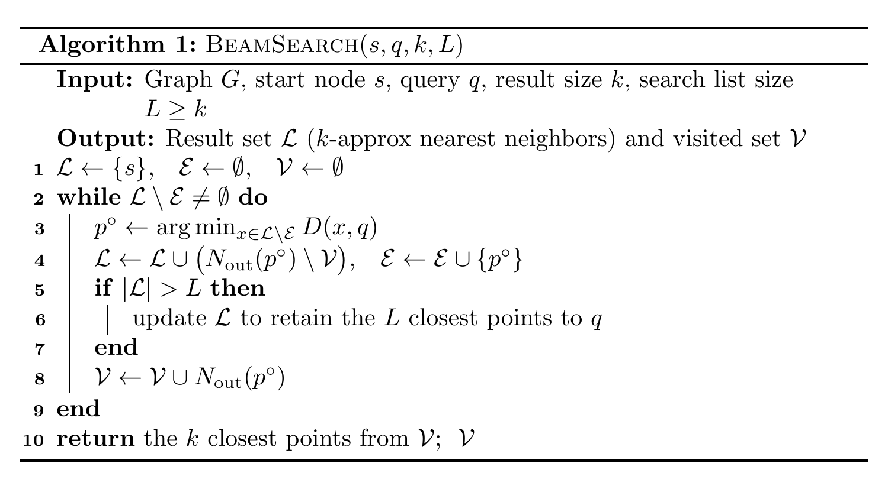
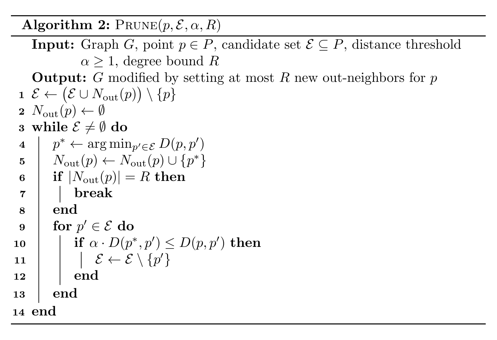

# 【NOTE 4】Beam Search Accuracy Analysis of DISKANN

---

在前三篇笔记中，我们沿着 Indyk & Xu [NeurIPS 2023] 的思路，建立了对 DiskANN 的理论理解：NOTE 1 证明了 DiskANN 构建的图是 $(1+\epsilon)$-PG（即 $(1+\epsilon)$-navigable）；NOTE 2 用 Doubling Dimension 分析了图的边数（度数）；NOTE 3 证明了 **Greedy Search**（即**候选队列大小为 1** 的搜索）能保证 $O((1/\epsilon)^\lambda \cdot \log^2 \Delta)$ 的查询时间。

然而，Indyk & Xu 的分析还存在改进的空间：

1.  **只分析了 Greedy（候选队列大小 = 1）。** 实际系统中，graph-based ANN 普遍使用 **Beam Search**（候选队列宽度 $L > 1$）来一次性检索 $k > 1$ 个候选近邻。Greedy 的保证无法直接推广到 beam search 返回的 $k$ 个结果上。
2.  **近似比常数偏松。** 对于任意 metric，Indyk & Xu 给出的近似比是 $\frac{\alpha+1}{\alpha-1}$。但实际应用绝大多数使用 **Euclidean ($\ell_2$)** metric，这个额外的几何结构是否能换来更紧的近似比？

本篇笔记跟随 Gollapudi et al. [ICML 2025] 的工作 *Sort Before You Prune: Improved Worst-Case Guarantees of the DiskANN Family of Graphs*，回答上述问题。其核心洞察是：DiskANN 的建图过程中，**Prune 算法是按照到中心点的距离排序后再剪枝的**，这个看似不起眼的「排序」步骤蕴含了一个比 $\alpha$-reachability 更强的结构性质，称为 **sorted $\alpha$-reachability**。利用它，本文：

*   把 Euclidean metric 下的近似比从 $\frac{\alpha+1}{\alpha-1}$ 改进到 $\frac{\alpha}{\alpha-1}$（例如 $\alpha=2$ 时，从 $3$ 改进到 $2$）；
*   给出了 **beam search（$k>1$）** 的第一个 worst-case 近似保证。

---

## (4.1) Beam Search 算法

我们首先形式化 Beam Search（也是 HNSW / DiskANN / NSG 在搜索阶段实际使用的算法）。它是 NOTE 1 中 Greedy Search 的推广：维护一个大小为 $L$ 的**候选队列**（candidate queue，即原文的 *beam* / 搜索列表；下文一律称「候选队列」），每次扩展队列中**离查询点 $q$ 最近、且尚未扩展**的节点，直到队列中所有节点都被扩展为止。

> $\mathcal{L}$ 是当前最好的 $L$ 个节点的列表，$\mathcal{E}$ 是已被扩展的节点集合，$\mathcal{V}$ 是所有被访问过的节点集合。第 3 行每次取出列表中离 $q$ 最近且尚未扩展的节点 $p^{\circ}$（与 NOTE 1 greedy 的当前点记号一致），第 4 行扩展它的出邻居。

> 当 $L = k = 1$ 时，Algorithm 1 退化为 NOTE 1 中的 Greedy Search。Beam search 的终止状态是一个 **locally optimal beam（局部最优候选队列）**：列表 $\mathcal{L}$ 中所有节点都被扩展过，意味着无法再通过任何节点的出邻居把列表「变得更接近 $q$」。

我们把搜索终止时列表中的 $L$ 个节点记为 $B_L = \{\hat{b}_1, \hat{b}_2, \dots, \hat{b}_L\}$，并约定它们**按到 $q$ 的距离升序排列**（即 $\hat{b}_1$ 最近）。本篇的目标就是分析这些 $\hat{b}_j$ 的近似质量。

---

## (4.2) Prune 算法与 $\alpha$-reachability

DiskANN 的建图（NOTE 1 (1.4)）本质上是对每个点 $p$ 调用一个 **Prune** 过程来选择出邻居。我们把它写得更精确一些：

> 第 4 行是**关键**：候选点是按照到 $p$ 的距离**从近到远**被依次选为出邻居的。第 10 行是 NOTE 1 中介绍过的剪枝条件 $\alpha \cdot D(p^*, p') \le D(p, p')$。

### (4.2.1) Definition：$\alpha$-reachable graph

有向图 $G$ 称为 **$\alpha$-reachable**（$\alpha \ge 1$），如果对于任意两点 $p, v \in V$，以下两者至少之一成立：

*   边 $(p, v)$ 存在；
*   $p$ 存在一个出邻居 $p_{\text{out}}$，满足 $D(p_{\text{out}}, v) \le \frac{D(p, v)}{\alpha}$。

> 这正是 NOTE 1 (1.4.2) 的 Shortcut Property，且**字母完全对齐**：源点 $p$、目标点 $v$、出邻居 $p_{\text{out}}$ 均与 NOTE 1 一致。Indyk & Xu 证明了 slow-preprocessing DiskANN 产生的图是 $\alpha$-reachable 的，并由此得到 $\frac{\alpha+1}{\alpha-1}$ 的近似比。

---

## (4.3) 核心概念：Sorted $\alpha$-reachable Graphs

Gollapudi et al. 的关键观察是：在 Algorithm 2 的第 4 行，候选点是**按照到 $p$ 的距离从近到远**被依次选为出邻居的。也就是说，当因为某个点 $p_{\text{out}}$ 和另一个点 $v$ 太近，把点 $v$ 剪枝掉时（第 8 行），$p_{\text{out}}$ 一定是在 $v$ **之前**被选中的，因此 $p_{\text{out}}$ 离 $p$ 比 $v$ 更近。这个「排序」信息是 $\alpha$-reachability 定义里完全没有用到的。把它显式地补进定义，就得到：

### (4.3.1) Definition 3.1：Sorted $\alpha$-reachable graph

给定数据集 $P$、metric $D$ 和 $\alpha > 1$。有向图 $G$ 称为 **sorted $\alpha$-reachable**，如果对于任意一对点 $p, v \in P$，以下两者至少之一成立：边 $(p, v)$ 存在；或者 $p$ 存在一个出邻居 $p_{\text{out}} \in P$ 满足：

1.  $(p, p_{\text{out}})$ 是 $G$ 中的一条边；
2.  $D(p_{\text{out}}, v) \le \dfrac{D(p, v)}{\alpha}$ ；（**$\alpha$-reachability**）
3.  $D(p, p_{\text{out}}) \le D(p, v)$ 。（**sorting property，新增的排序性质**）

> 前两条就是普通的 $\alpha$-reachability。第三条「排序性质」是新增的：负责把 $v$ 剪掉的那个出邻居 $p_{\text{out}}$，必须**比 $v$ 离 $p$ 更近**。
>
> **几何直观（原文 Figure 1 vs Figure 2）：** 在普通 $\alpha$-reachability 中，出邻居 $p_{\text{out}}$ 只需满足 $D(p_{\text{out}},v) \le D(p,v)/\alpha$，它可以位于 $v$ 附近的任意位置；而在 sorted 版本中，$p_{\text{out}}$ 还被额外约束在「以 $p$ 为中心、半径 $D(p,v)$ 的球内」。正是这个额外约束在 Euclidean 空间里收紧了近似比。

### (4.3.2) Lemma 3.2：slow-preprocessing DiskANN 产生 sorted $\alpha$-reachable 图

**结论：** 对任意 metric $D$ 和 $\alpha > 1$，slow-preprocessing 变体的 DiskANN 算法构建出的图是 **sorted $\alpha$-reachable** 的。

**证明（反证法）：** 

设 DiskANN 构建的图为 $G(V, E)$。假设存在一对点 $p, v \in V$，使得**不存在**满足 Definition 3.1 的 $p_{\text{out}}$。分两种情况：

1.  **存在边 $(p, v)$。** 这直接满足 Definition 3.1 的要求，与假设矛盾。
2.  **不存在边 $(p, v)$。** 这意味着在对 $p$ 运行 Algorithm 2 时，$v$ 最终没有成为 $p$ 的出邻居，即 $v$ 被某个点剪枝了。设 $u$ 是**在 $v$ 之前**被选中（第 4 行）并把 $v$ 剪掉（第 8 行）的那个点。
    *   由于 $u$ 在 $v$ 之前被选中，而第 4 行总是选离 $p$ 最近的点，故 $D(p, u) \le D(p, v)$ —— 这正是**排序性质**（条件 3）；
    *   由于 $u$ 触发了对 $v$ 的剪枝，剪枝条件给出 $\alpha \cdot D(u, v) \le D(p, v)$，即 $D(u, v) \le \frac{D(p, v)}{\alpha}$ —— 这正是 **$\alpha$-reachability**（条件 2）；
    *   而 $u$ 是 $p$ 的出邻居，满足条件 1。

    于是取 $p_{\text{out}} = u$ 即可同时满足 Definition 3.1 的三个条件，与假设矛盾。

综上，假设不成立，$G$ 是 sorted $\alpha$-reachable 的。$\square$

---

## (4.4) 局部最优解的近似质量 (Approximation Quality of Local Optimum)

我们先分析最简单的情形：**候选队列大小 = 1 的 greedy search**。回忆 NOTE 3，greedy 终止于一个**局部最优点 $p$**（即 $p$ 的所有出邻居都不比 $p$ 更接近 $q$）。我们要问：这个 $p$ 能差到什么程度？

> **本节起的记号约定：** 局部最优点（greedy 终止点）记为 $p$、查询 $q$ 的精确最近邻记为 $p^*$（与 NOTE 1/3 一致）；beam search 部分（4.5 起）把搜索返回的**近似结果**记为 $\hat{b}_j$、把 $q$ 的**第 $j$ 个真实最近邻**记为 $b^*_j$。把 Definition 3.1 用到搜索分析时，其源点恰为局部最优点 $p$（同名），目标点 $v$ 取为最近邻 $p^*$。

设 $p^*$ 是 $q$ 的精确最近邻。我们想 bound 近似比 $\frac{D(p, q)}{D(p^*, q)}$。关键观察是：因为 $p$ 是局部最优，且 $p^*$ **不是** $p$ 的出邻居（否则 greedy 会走过去），根据 sorted $\alpha$-reachability（Definition 3.1，源点取局部最优点 $p$、目标点 $v\!=\!p^*$），必存在一个**负责剪掉 $(p,p^*)$ 边**的出邻居 $p_{\text{out}}$。这个 $p_{\text{out}}$ 满足上述三条性质。由于 $p$ 是局部最优、$p_{\text{out}}$ 是 $p$ 的出邻居，必有 $D(p, q) \le D(p_{\text{out}}, q)$。因此可以把近似比的分析归结为下面这个优化问题，求最坏情形下 $p_{\text{out}}$ 能离 $q$ 多远：

### (4.4.1) Optimization Problem 1

把 $p^*$ 与 $q$ 的距离归一化为 $1$，则局部最优解 $p$ 的近似比上界由下式刻画：
$$
\begin{aligned}
\rho_{\text{opt}} \;=\; \max \quad & D(p_{\text{out}}, q) \\
\text{s.t.} \quad & D(q, p) \le D(q, p_{\text{out}}), \\
& D(p^*, p_{\text{out}}) \le \frac{D(p, p^*)}{\alpha}, \\
& D(p, p_{\text{out}}) \le D(p, p^*), \\
& D(p^*, q) = 1 .
\end{aligned}
$$
其中 $D(\cdot, \cdot)$ 是一个 metric（满足三角不等式）。这里 $\rho_{\text{opt}}$ 记该优化问题的**最优目标值**，即最坏情形下的**近似比**（是 $\alpha$ 的函数，下面会算出它等于 $\frac{\alpha+1}{\alpha-1}$ 或 $\frac{\alpha}{\alpha-1}$）。

> ⚠️ **记号说明：** 本篇用 $\rho_{\text{opt}}$ 表示近似比，以免与 prune 参数 $\alpha$ 混淆；**原文 Gollapudi et al. 将此量记作 $\alpha_{\text{opt}}$**。注意 $\rho_{\text{opt}}$ 是「近似比」而非「$\alpha$ 的某个最优取值」。

> 四个约束分别对应：$p$ 的局部最优性（$D(q,p) \le D(q,p_{\text{out}})$）、$\alpha$-reachability、**sorting property**、以及归一化。注意如果去掉 sorting property 这一条，就退化成 Indyk & Xu 的分析。

### (4.4.2) Lemma 3.3：一般 metric 下 $\rho_{\text{opt}} \le \frac{\alpha+1}{\alpha-1}$

对于一般 metric，反复使用三角不等式与 $\alpha$-reachability 即可：
$$
\begin{aligned}
D(q, p_{\text{out}}) &\le D(q, p^*) + D(p^*, p_{\text{out}}) \le D(q, p^*) + \frac{D(p^*, p)}{\alpha} \\
&\le D(q, p^*) + \frac{D(p^*, q) + D(q, p)}{\alpha} \le D(q, p^*) + \frac{D(p^*, q) + D(q, p_{\text{out}})}{\alpha}
\end{aligned}
$$
其中最后一步用了局部最优性 $D(q, p) \le D(q, p_{\text{out}})$。整理含 $D(q,p_{\text{out}})$ 的项：
$$
D(q, p_{\text{out}})\left(1 - \frac{1}{\alpha}\right) \le D(q, p^*)\left(1 + \frac{1}{\alpha}\right)
\;\Longrightarrow\;
D(q, p_{\text{out}}) \le \frac{\alpha + 1}{\alpha - 1} \cdot D(q, p^*).
$$
代入 $D(p^*, q) = 1$ 即得 $\rho_{\text{opt}} \le \frac{\alpha+1}{\alpha-1}$。$\square$

> 这与 Indyk & Xu 的结论一致。注意这个证明里**完全没有用到 sorting property（条件 3）**——对一般 metric，sorting 帮不上忙。下面我们会看到，对 Euclidean metric，sorting 才会发挥作用。

### (4.4.3) Lemma 3.4：Euclidean ($\ell_2$) metric 下 $\rho_{\text{opt}} \le \frac{\alpha}{\alpha-1}$

当 $D$ 是 Euclidean $\ell_2$ metric 时，Optimization Problem 1 的最优值可被收紧到 $\frac{\alpha}{\alpha-1}$。

**证明：** 待界定的优化问题是
$$
\begin{aligned}
\max \quad & D(p_{\text{out}}, q) \\
\text{s.t.} \quad
& D(q, p) \le D(q, p_{\text{out}}), \\
& D(p^*, p_{\text{out}}) \le \frac{D(p, p^*)}{\alpha}, \\
& D(p, p_{\text{out}}) \le D(p, p^*), \\
& D(p^*, q) = 1 .
\end{aligned}
$$

**第一步：平方 → 半定规划松弛 (SDP relaxation)。** 在 Euclidean 空间里每个距离都能写成内积：$D(x,y)^2 = \lVert x-y\rVert^2 = x^\top x - 2x^\top y + y^\top y$。把目标与前三条约束全部**平方**，并把归一化 $D(p^*,q)=1$ 松弛为 $\lVert q-p^*\rVert^2 \le 1$，得到一个以向量 $q,p,p_{\text{out}},p^*$ 为变量的程序：
$$
\begin{aligned}
\max \quad & \lVert q-p_{\text{out}}\rVert^2 \\
\text{s.t.} \quad
& \lVert q-p\rVert^2 \le \lVert q-p_{\text{out}}\rVert^2, \\
& \alpha^2\lVert p^*-p_{\text{out}}\rVert^2 \le \lVert p-p^*\rVert^2, \\
& \lVert p-p_{\text{out}}\rVert^2 \le \lVert p-p^*\rVert^2, \\
& \lVert q-p^*\rVert^2 \le 1 .
\end{aligned}
$$
由于这些内积变量构成的 Gram 矩阵只需满足半正定 (PSD) 而非"恰好可由 $d$ 维实向量实现"，上式是原问题的一个 **SDP 松弛**；原问题的最优值正是此 SDP 最优值的**平方根**。故只要给出 SDP 目标的上界即可。

**第二步：弱对偶 (weak duality)。** 为四条约束引入对偶变量 $\lambda_1,\lambda_2,\lambda_3,\lambda_4 \ge 0$，按惯例构造 Lagrangian（目标加上各约束加权后的松弛项）：
$$
\begin{aligned}
\mathcal{L}(q,p,p_{\text{out}},p^*) =\;& \lVert q-p_{\text{out}}\rVert^2
+ \lambda_1\big(\lVert q-p\rVert^2 - \lVert q-p_{\text{out}}\rVert^2\big) \\
& + \lambda_2\big(\alpha^2\lVert p^*-p_{\text{out}}\rVert^2 - \lVert p-p^*\rVert^2\big)
+ \lambda_3\big(\lVert p-p_{\text{out}}\rVert^2 - \lVert p-p^*\rVert^2\big) \\
& + \lambda_4\,\lVert q-p^*\rVert^2 .
\end{aligned}
$$
对偶程序为：在「$\mathcal{L}(q,p,p_{\text{out}},p^*)\ge 0$ 对**所有**向量配置成立」的约束下，最小化对偶目标 $\lambda_4$（即归一化约束 $\lVert q-p^*\rVert^2\le 1$ 的乘子）。弱对偶定理保证：任何这样的**对偶可行解**都给出原 SDP 目标的一个上界 $\lambda_4$。

**第三步：构造对偶可行解。** 取
$$
\lambda_1 = \frac{1}{\alpha-1},\quad
\lambda_2 = \frac{\alpha}{(2\alpha-1)(\alpha-1)},\quad
\lambda_3 = \frac{\alpha}{2\alpha-1},\quad
\lambda_4 = \left(\frac{\alpha}{\alpha-1}\right)^2 .
$$
将这组取值代入后，$\mathcal{L}(q,p,p_{\text{out}},p^*)$ **恰好化为一个完全平方式 (perfect square)**（机械的配方验证见原文 Appendix A.3），从而对任意 $q,p,p_{\text{out}},p^*$ 都有 $\mathcal{L}\ge 0$——这正验证了对偶可行性。于是由弱对偶，SDP 目标 $\le \lambda_4 = \big(\tfrac{\alpha}{\alpha-1}\big)^2$，即
$$
\lVert q-p_{\text{out}}\rVert^2 \le \left(\frac{\alpha}{\alpha-1}\right)^2 \lVert q-p^*\rVert^2 \le \left(\frac{\alpha}{\alpha-1}\right)^2 .
$$
开平方即得 $\rho_{\text{opt}} = D(p_{\text{out}},q) \le \dfrac{\alpha}{\alpha-1}$。$\square$

> **为什么 Euclidean 才能收紧？** 一般 metric 下问题是关于 $16$ 个距离变量 $D(x,y)$（$x,y\in\{p,q,p_{\text{out}},p^*\}$）的**线性规划**，sorting 约束 $D(p,p_{\text{out}})\le D(p,p^*)$ 无法被三角不等式"激活"（见 Lemma 3.3 的证明根本没用到它）。而 Euclidean 把问题升格为 SDP（PSD 约束远强于三角不等式），此时 sorting 约束 $\lambda_3$ 项才真正进入完全平方式、贡献了 $\frac{\alpha+1}{\alpha-1}\to\frac{\alpha}{\alpha-1}$ 的收紧。

> **改进的来源：** Euclidean 情形下的提升直接来自 sorting property $D(p, p_{\text{out}}) \le D(p, p^*)$。原文还在 Appendix A.5 / A.6 构造了**紧例子**：（i）存在实例使局部最优解恰好达到 $\frac{\alpha}{\alpha-1}$（说明 bound 是紧的）；（ii）如果**去掉** sorting 约束，则即使在 Euclidean 空间，$\frac{\alpha+1}{\alpha-1}$ 仍然是紧的——这从反面凸显了 sorting property 的不可或缺。

### (4.4.4) Corollary 3.5：Greedy Search 的保证

综合上述，对任意数据集 $P$ 和查询 $q$，greedy search 终止于一个局部最优点 $p$，它是 $q$ 的：

*   $\frac{\alpha+1}{\alpha-1}$-近似最近邻（一般 metric）；
*   $\frac{\alpha}{\alpha-1}$-近似最近邻（Euclidean metric）。

> 对照 NOTE 3：取 $\alpha = 1 + 4/\epsilon$ 时，$\frac{\alpha+1}{\alpha-1} = 1 + \epsilon/2 \le 1+\epsilon$，与我们之前得到的 $(1+\epsilon)$-ANN 一致。而对常用的 $\alpha = 2$，一般 metric 的近似比是 $3$，Euclidean 则被改进到 $2$。

---

## (4.5) Beam Search 的逐点保证 (Pointwise Guarantee for $k > 1$)

现在推广到 $k > 1$。这是本文相对 Indyk & Xu 最重要的新结果：不仅 候选队列里最近的 $\hat{b}_1$ 有保证，**候选队列里的每个 $\hat{b}_j$ 都有保证**。

### (4.5.1) Lemma 3.6：Beam Search 的逐点近似

设 $G$ 是 sorted $\alpha$-reachable 图，$B_L = \{\hat{b}_1, \dots, \hat{b}_L\}$ 是 beam search 返回的局部最优候选队列（按到 $q$ 距离升序）。对每个 $j \in [L]$，记 $B_{j-1} = \{\hat{b}_1, \dots, \hat{b}_{j-1}\}$ 为前 $j{-}1$ 个点。则：
$$
D(\hat{b}_j, q) \le \frac{\alpha}{\alpha-1} \cdot \min_{x \in G,\; x \notin B_{j-1}} D(q, x) \qquad (\ell_2 \text{ metric})
$$
$$
D(\hat{b}_j, q) \le \frac{\alpha+1}{\alpha-1} \cdot \min_{x \in G,\; x \notin B_{j-1}} D(q, x) \qquad (\text{general metric})
$$

**证明：** 固定位置 $j$。令
$$
\tilde{p}^*_j := \arg\min_{x \in G,\; x \notin B_{j-1}} D(q, x)
$$
为**不在 Beam Search 候选队列的前 $j{-}1$ 个元素中的**，离 $q$ 最近的点（即本位置要逼近的最近邻目标）。注意它是**受限于 $G\setminus B_{j-1}$ 的最近邻**，故用带波浪号与下标的 $\tilde{p}^*_j$，以区别于数据集全局的第 $j$ 个最近邻 $p^*_j$。再令 $p := \arg\min_{\hat{b}_i \in B_L} D(\hat{b}_i, \tilde{p}^*_j)$ 为整个候选队列 $B_L$ 中离 $\tilde{p}^*_j$ 最近的元素。

**（i）$p$ 没有指向 $\tilde{p}^*_j$ 的边。** 否则，把 $\tilde{p}^*_j$ 加入并逐出当前 候选队列中最远的 $\hat{b}_L$，会得到一个到 $q$ 更优的列表，与 $B_L$ 是局部最优候选队列矛盾。

**（ii）调用 sorted $\alpha$-reachability。** 既然 $(p,\tilde{p}^*_j)$ 不是边，由 Definition 3.1，存在出邻居 $p_{\text{out}}$ 满足
$$
D(p_{\text{out}}, \tilde{p}^*_j) \le \frac{D(p, \tilde{p}^*_j)}{\alpha}, \qquad D(p, p_{\text{out}}) \le D(p, \tilde{p}^*_j) .
$$

**（iii）"one-shot" 上界。** 分两步把 $p_{\text{out}}$ 钉死：
*   $p_{\text{out}}$ 比 $p$ 更靠近 $\tilde{p}^*_j$（$D(p_{\text{out}},\tilde{p}^*_j)\le D(p,\tilde{p}^*_j)/\alpha < D(p,\tilde{p}^*_j)$）。但 $p$ 是 候选队列中离 $\tilde{p}^*_j$ 最近的元素，故 $p_{\text{out}} \notin B_L$——否则 $p_{\text{out}}$ 会取代 $p$ 成为离 $\tilde{p}^*_j$ 最近者；
*   然而 $p$ 有一条指向 $p_{\text{out}}$ 的出边，而候选队列已局部最优，说明 $p_{\text{out}}$ 已被 $p$ 的扩展「看到」却仍未能进入候选队列。这只可能是因为 候选队列中**每一个**元素都不比 $p_{\text{out}}$ 离 $q$ 更远：
$$
D(\hat{b}_i, q) \le D(p_{\text{out}}, q) \qquad \forall\, \hat{b}_i \in B_L .
$$
    特别地 $D(p,q)\le D(p_{\text{out}},q)$。**注意这一步同时 bound 住了 候选队列里所有的 $\hat{b}_i$，而只用了一个出邻居 $p_{\text{out}}$**——这就是"one shot"的来历。

**（iv）归结到 Optimization Problem 1。** 把上面收集到的关系
$$
\begin{aligned}
D(q,p) &\le D(q,p_{\text{out}}), \\
D(\tilde{p}^*_j,p_{\text{out}}) &\le \frac{D(p,\tilde{p}^*_j)}{\alpha}, \\
D(p,p_{\text{out}}) &\le D(p,\tilde{p}^*_j)
\end{aligned}
$$
与归一化 $D(\tilde{p}^*_j,q)=1$ 放在一起，最大化 $D(p_{\text{out}},q)$ 正是 (4.4.1) 的 Optimization Problem 1，其最优值记为 $\rho_{\text{opt}}$。于是对该位置的 $\hat{b}_j$：
$$
\frac{D(\hat{b}_j, q)}{D(\tilde{p}^*_j, q)} \le \frac{D(p_{\text{out}}, q)}{D(\tilde{p}^*_j, q)} \le \rho_{\text{opt}} .
$$
代入 Lemma 3.4（$\ell_2$：$\rho_{\text{opt}}=\frac{\alpha}{\alpha-1}$）与 Lemma 3.3（一般 metric：$\frac{\alpha+1}{\alpha-1}$），并回代 $D(\tilde{p}^*_j,q)=\min_{x\notin B_{j-1}}D(q,x)$，即得两式。$\square$

> **关键的「one shot」技巧：** 单个出邻居 $p_{\text{out}}$ 同时为 候选队列里的**每一个** $\hat{b}_i$ 提供了到 $q$ 的距离上界，这就是为什么 候选队列中的每一个位置 $\hat{b}_j$ 都能被一次性地 bound 住，而不需要对 $k$ 个结果分别论证。

### (4.5.2) Theorem 3.7：Beam Search 的逐点保证

设 $G$ 是 sorted $\alpha$-reachable 图，$B_L = \{\hat{b}_1, \dots, \hat{b}_L\}$ 是 beam search 返回的局部最优候选队列。则对每个 $j$，$\hat{b}_j$ 是 $q$ 的第 $j$ 个最近邻 $b^*_j$ 的好近似：
$$
D(\hat{b}_j, q) \le \frac{\alpha}{\alpha-1} \cdot D(b^*_j, q) \;\; (\ell_2), \qquad
D(\hat{b}_j, q) \le \frac{\alpha+1}{\alpha-1} \cdot D(b^*_j, q) \;\; (\text{general}),
$$
其中 $b^*_j$ 是 $q$ 的第 $j$ 个最近邻。

**证明：** 由 Lemma 3.6，$D(\hat{b}_j,q)\le \rho_{\text{opt}}\cdot \min_{x\in G,\,x\notin B_{j-1}} D(q,x)$。只需证明
$$
\min_{x\in G,\; x\notin B_{j-1}} D(q,x) \le D(b^*_j, q) .
$$
考虑 $q$ 的前 $j$ 个真实最近邻 $b^*_1,\dots,b^*_j$。由于 $\lvert B_{j-1}\rvert = j-1 < j$，这 $j$ 个点中**至少有一个** $b^*_\ell$（$\ell\le j$）不在 $B_{j-1}$ 里。该 $b^*_\ell$ 满足 $b^*_\ell\notin B_{j-1}$ 且 $D(b^*_\ell,q)\le D(b^*_j,q)$（因为 $\ell\le j$），故
$$
\min_{x\notin B_{j-1}} D(q,x) \le D(b^*_\ell, q) \le D(b^*_j, q) .
$$
代回 Lemma 3.6 即得 $D(\hat{b}_j,q)\le \rho_{\text{opt}}\cdot D(b^*_j,q)$，再分别代入 $\ell_2$ 与一般 metric 下的 $\rho_{\text{opt}}$。$\square$

> 这是**第一个**针对 beam search 检索 $k > 1$ 个候选近邻的 worst-case 保证。它说明：beam search 不仅第 1 个结果好，整个 top-$k$ 列表的**每一位**都满足同样的近似比。

---

## (4.6) 收敛速率与最终定理 (Convergence Rate)

(4.5) 只分析了 beam search **终止时**（局部最优候选队列）的质量，但没说需要**多少步**才能到达。本节补上收敛速率。

为此，原文把 Optimization Problem 1 改造为 **Optimization Problem 2**：去掉局部最优约束 $D(q,p)\le D(q,p_{\text{out}})$，换成一个带"偏离参数 $\beta$"的约束 $D(q,p)\le \beta + \rho_{\text{opt}}$，用以度量「当前点 $p$ 偏离局部最优的程度」：

$$
\begin{aligned}
\max \quad & D(p_{\text{out}}, q) \\
\text{s.t.} \quad
& D(p^*, p_{\text{out}}) \le \frac{D(p, p^*)}{\alpha}, \\
& D(p, p_{\text{out}}) \le D(p, p^*), \\
& D(p^*, q) = 1, \\
& D(q, p) \le \beta + \rho_{\text{opt}} .
\end{aligned}
$$

> 当 $\beta = 0$ 时，$D(q,p)\le \rho_{\text{opt}}$ 恰好是「已收敛」的状态，问题退回到 Optimization Problem 1 的量级。$\beta>0$ 则刻画了「还差 $\beta$ 才到位」时，下一步能走到的出邻居 $p_{\text{out}}$ 有多近。

### (4.6.1) 每一步的几何收缩

#### Lemma 3.8（一般 metric）

**结论：** 在 Optimization Problem 2 中，$D(p_{\text{out}},q)$ 至多为 $\dfrac{\alpha+1}{\alpha-1} + \dfrac{\beta}{\alpha}$。

**证明：** 反复使用三角不等式与约束。先用三角不等式与 $\alpha$-reachability（第一条约束）：
$$
D(p_{\text{out}},q) \le D(p_{\text{out}},p^*) + D(p^*,q) \le \frac{D(p,p^*)}{\alpha} + D(p^*,q) .
$$
再对 $D(p,p^*)$ 用三角不等式 $D(p,p^*)\le D(p,q)+D(p^*,q)$，并代入第四条约束 $D(p,q)\le \beta+\rho_{\text{opt}}$（此处一般 metric 取 $\rho_{\text{opt}}=\frac{\alpha+1}{\alpha-1}$）与归一化 $D(p^*,q)=1$：
$$
\begin{aligned}
D(p_{\text{out}},q) &\le \frac{D(p,q)+D(p^*,q)}{\alpha} + D(p^*,q)
= \frac{\beta + \frac{\alpha+1}{\alpha-1}}{\alpha} + \frac{1}{\alpha} + 1 \\
&= \frac{\beta}{\alpha} + \underbrace{\frac{\alpha+1}{(\alpha-1)\alpha} + \frac{\alpha+1}{\alpha}}_{=\,\frac{\alpha+1}{\alpha}\left(\frac{1}{\alpha-1}+1\right)\,=\,\frac{\alpha+1}{\alpha-1}}
= \frac{\beta}{\alpha} + \frac{\alpha+1}{\alpha-1} . \qquad \square
\end{aligned}
$$

#### Lemma 3.9（Euclidean metric）

**结论：** 在 Optimization Problem 2 中，$D(p_{\text{out}},q)$ 至多为 $\dfrac{\alpha}{\alpha-1} + \dfrac{\beta}{\alpha}$。

**证明：** 与 Lemma 3.4 同法。把所有距离平方（$D:=\lVert\cdot\rVert^2$），约束变为
$$
\begin{aligned}
\lVert p^*-p_{\text{out}}\rVert^2 &\le \frac{\lVert p-p^*\rVert^2}{\alpha^2}, &
\lVert p-p_{\text{out}}\rVert^2 &\le \lVert p-p^*\rVert^2, \\
\lVert q-p^*\rVert^2 &= 1, &
\lVert q-p\rVert^2 &\le \Big(\beta+\tfrac{\alpha}{\alpha-1}\Big)^2 ,
\end{aligned}
$$
目标 $\max \lVert q-p_{\text{out}}\rVert^2$。把内积矩阵松弛为半正定即得 SDP。为五条约束（含 $D(p^*,q)\ge1$ 与 $\le1$ 两半）引入对偶变量 $\lambda_1,\dots,\lambda_5\ge0$，写出 Lagrangian
$$
\begin{aligned}
\mathcal{L} =\;& \lambda_1\!\left(\lVert p^*-p_{\text{out}}\rVert^2 - \tfrac{\lVert p-p^*\rVert^2}{\alpha^2}\right)
- \lambda_2\!\left(\lVert p^*-q\rVert^2 - 1\right)
+ \lambda_3\!\left(\lVert p^*-q\rVert^2 - 1\right) \\
&+ \lambda_4\!\left(\lVert p-p_{\text{out}}\rVert^2 - \lVert p-p^*\rVert^2\right)
+ \lambda_5\!\left(\lVert q-p\rVert^2 - \lVert q-p_{\text{out}}\rVert^2\right) ,
\end{aligned}
$$
对偶程序为 $\min\big[\lambda_2 - \lambda_3 + \lambda_5(\beta+\tfrac{\alpha}{\alpha-1})^2\big]$ 使 $\mathcal{L}(p_{\text{out}},q,p,p^*)\ge0$ 恒成立。代入原文 Appendix B.2 给出的一组（形式较繁的）$\lambda_1,\dots,\lambda_5$ 后，$\mathcal{L}$ 化为完全平方式，对偶目标值恰为 $\big(\tfrac{\beta}{\alpha}+\tfrac{\alpha}{\alpha-1}\big)^2$。由弱对偶，SDP 目标 $\le \big(\tfrac{\beta}{\alpha}+\tfrac{\alpha}{\alpha-1}\big)^2$，开方得 $D(p_{\text{out}},q)\le \dfrac{\beta}{\alpha}+\dfrac{\alpha}{\alpha-1}$。$\square$

> **核心直觉（几何收缩）：** 两条引理的形状都是 $D(p_{\text{out}},q)\le \rho_{\text{opt}} + \frac{\beta}{\alpha}$。这说明：当前点偏离局部最优 $\beta$，走一步到 $p_{\text{out}}$ 后偏离量被压缩为 $\frac{\beta}{\alpha}$——**每一次有效扩展（successful step）把"残差"乘以 $\frac1\alpha$**，按 $\alpha$ 的几何级数衰减。因此从初始偏离衰减到 $\epsilon$ 量级只需 $O(\log_\alpha(\cdot))$ 步。这与 NOTE 3 中「距离按 $\alpha^i$ 指数下降 → $O(\log\Delta)$ 跳」完全同构，只是这里要同时追踪 候选队列里的 $L$ 个元素。

### (4.6.2) Theorem 1.1：最终收敛界 (Final Convergence Bounds)

设 $G$ 是 DiskANN 图。对任意查询 $q$，大小为 $L$ 的 **BeamSearch** 在至多
$$
O\!\left(L + \log_\alpha \frac{\delta}{(\alpha-1)\epsilon}\right)
$$
步内输出一组点 $\{\hat{b}_1, \dots, \hat{b}_L\}$，使得每个 $\hat{b}_j$ 满足：
$$
D(\hat{b}_j, q) \le \epsilon + \frac{\alpha}{\alpha-1} \cdot D(b^*_j, q) \qquad (\ell_2 \text{ metric})
$$
$$
D(\hat{b}_j, q) \le \epsilon + \frac{\alpha+1}{\alpha-1} \cdot D(b^*_j, q) \qquad (\text{general metric})
$$
其中 $b^*_j$ 是 $q$ 的第 $j$ 个最近邻，$\delta$ 是数据集的 Aspect Ratio（原文记号；即 NOTE 3 中的 $\Delta$）。

**证明** 分三步：先用两个引理分别处理 unsuccessful 与 successful 步，再合成。先定义 step 的好坏：设第 $i$ 步扩展的是 候选队列中当前节点 $p$，其状态记为 $B^{(i)}$。若它引入了一个比 $p$ 离 $q$ 更近、且排在 $p$ **之前**的新节点（即 $D(p,q) > \min_{x\in N_{\mathrm{out}}(p)\setminus B^{(i)}} D(x,q)$），称该步 **successful**；否则称 **unsuccessful**（没有更近的出邻居被加入，该位置已无改进余地）。

**Lemma B.1（unsuccessful 步的稳定性）：** 经过 $i$ 个 unsuccessful 步后，候选队列第 $i$ 个元素 $\hat{b}_i$ 满足 $D(\hat{b}_i,q)\le \rho_{\text{opt}}\cdot D(b^*_i,q)$。

> **证明：** 称一个节点 **inactive**：它的邻域已被扩展且扩展是 unsuccessful 的。若位置 $r$ 处的节点 $\hat{b}_r$ inactive，则候选队列前 $r$ 个元素 $\{\hat{b}_1,\dots,\hat{b}_r\}$ 构成一个**局部最优候选队列**（它们都无法再改进），由 Lemma 3.6 得 $D(\hat{b}_r,q)\le\rho_{\text{opt}}\cdot D(b^*_r,q)$ $(\ast)$。又因为一个节点只有在它**上方所有节点都 inactive** 时才可能新近变为 inactive，故 $i$ 个 unsuccessful 步后恰有 $i$ 个 inactive 节点，且它们成为 inactive 时的位置都 $\le i$；由 $(\ast)$，每个的距离都 $\le \rho_{\text{opt}}\cdot D(b^*_i,q)$。而当前 候选队列第 $i$ 个元素 $\hat{b}_i$ 要么就是其中之一，要么不比它们中某个更远，故 $D(\hat{b}_i,q)\le\rho_{\text{opt}}\cdot D(b^*_i,q)$。$\square$

**Lemma B.2（successful 步的几何收缩）：** 设 Optimization Problem 1 的最优值为 $\rho_{\text{opt}}$、Problem 2 的偏离项系数为 $\frac1\alpha$。经过 $S$ 个 successful 步后，候选队列第 $i$ 个元素 $\hat{b}_{(i,S)}$ 满足
$$
D(\hat{b}_{(i,S)},q) \le \frac{\Gamma}{\alpha^{\,S-i}} + \max\!\Big(\rho_{\text{opt}},\,\tfrac{\alpha^2+1}{\alpha^2-1}\Big)\cdot D(b^*_i,q),
$$
其中 $\Gamma$ 是初始偏离量（一个由起点决定的常数）。

> **证明（对 successful 步数 $S$ 归纳）：** **基例** $S<i$：由三角不等式 $D(\hat{b}_{(i,S)},q)\le D(\hat{b}_{(i,S)},b^*_i)+D(b^*_i,q)\le \Gamma+D(b^*_i,q)$。**归纳步**：设第 $j$ 个 successful 步中 候选队列里**最靠前发生变化**的位置为 $\mathrm{LI}(j)$，则该步引入的新节点 $\hat{b}_{\mathrm{LI}(j)}$ 是这一步加入的、离 $q$ 最近者。
> *   若 $\mathrm{LI}(j)>i$：则前 $i$ 个位置 $\{\hat{b}_{(1,j-1)},\dots,\hat{b}_{(i,j-1)}\}$ 已是局部最优候选队列，由 Lemma 3.6，$D(\hat{b}_{(i,j)},q)\le\rho_{\text{opt}}\cdot D(b^*_i,q)$；
> *   若 $\mathrm{LI}(j)<i$：第 $i$ 个元素被向后挤，$D(\hat{b}_{(i,j)},q)\le D(\hat{b}_{(i-1,j-1)},q)$，由归纳假设得 $\le \Gamma/\alpha^{(j-1)-(i-1)}+\rho_{\text{opt}} D(b^*_{i-1},q)$；
> *   若 $\mathrm{LI}(j)=i$：当 $\hat{b}_{(i,j)}=b^*_i$ 时近似比平凡成立；否则借助 sorted $\alpha$-reachability 构造一条节点链 $S_1=\hat{b}_{(i,j-1)},\,S_{t+1}=f(S_t,\tilde{p}^*_{\mathrm{o}})$（$\tilde{p}^*_{\mathrm{o}}$ 是不在 候选队列里离 $q$ 最近者，$f(x,q)$ 取 $x$ 的出邻居中满足 $D(x,y)\le D(x,q)$ 且离 $q$ 最近的 $y$），它满足 $D(S_{t+1},\tilde{p}^*_{\mathrm{o}})\le D(S_t,\tilde{p}^*_{\mathrm{o}})/\alpha$，逐步逼近 $\tilde{p}^*_{\mathrm{o}}$。对链上首个尚未被扩展的 $S_t$ 用 Optimization Problem 2 的界（Lemma 3.8 / 3.9，偏离量恰好被乘以 $\frac1\alpha$），即得 $D(\hat{b}_{(i,j)},q)\le \frac{\beta}{\alpha}+\max\!\big(\rho_{\text{opt}},\frac{\alpha^2+1}{\alpha^2-1}\big)D(b^*_i,q)$，与归纳式比较即完成归纳。$\square$

**合成。** 联合 Lemma B.1 与 Lemma B.2，经过 $i$ 步后
$$
D(\hat{b}_{(l,i)},q) \le \frac{\Gamma}{\alpha^{\,i-l}} + \max\!\Big(\rho_{\text{opt}},\,\tfrac{\alpha^2+1}{\alpha^2-1}\Big)\cdot D(b^*_l,q),
$$
这与 Indyk & Xu [2023] Theorem 3.4 的不等式 (1) 同型。几何项 $\Gamma/\alpha^{\,i-l}$ 随步数指数衰减：初始偏离 $\Gamma$ 的量级由 Aspect Ratio $\delta$ 控制（$\Gamma = O(\delta)$），要把它压到 $\epsilon$，需要 $i-l = O\!\big(\log_\alpha\frac{\delta}{(\alpha-1)\epsilon}\big)$ 个有效步；叠加 候选队列里 $L$ 个位置各自「沉降」所需的 $O(L)$ 步，总步数即 $O\!\big(L+\log_\alpha\frac{\delta}{(\alpha-1)\epsilon}\big)$。最后把 $\rho_{\text{opt}}$ 分别代入 Lemma 3.9（$\ell_2$：$\frac{\alpha}{\alpha-1}$）与 Lemma 3.8（一般 metric：$\frac{\alpha+1}{\alpha-1}$）即得两个收敛界。$\square$

此外，BeamSearch **每一步的距离计算次数**不超过 DiskANN 图的最大度数，由 Indyk & Xu 的 Lemma（NOTE 2）给出为 $O\big((4\alpha)^{\lambda} \cdot \log \delta\big)$（$\lambda$ = Doubling Dimension，原文记作 $\Delta$）。

> **怎么读这个界：**
> *   **步数中的 $+L$：** 候选队列里有 $L$ 个位置需要逐个「沉降」到位，因此线性地至少需要 $\sim L$ 步；
> *   **步数中的 $\log_\alpha\frac{\delta}{(\alpha-1)\epsilon}$：** 几何收敛项，对应 NOTE 3 里的 $O(\log_\alpha \Delta)$ 跳数；
> *   **近似比：** Euclidean 下的 $\frac{\alpha}{\alpha-1}$ 是本文相对 Indyk & Xu（$\frac{\alpha+1}{\alpha-1}$）的核心改进，且对 候选队列里每一个 $\hat{b}_j$ 都成立。

---

## (4.7) 实验结论 (Empirical Validation)

理论之外，原文还在真实数据集（SIFT1M、OpenAI、Cohere/Wikipedia、SPACEV）上验证了「先排序再剪枝」的重要性。做法是对照两种实现：一种在调用 Prune 前**对候选邻居按距离排序**（sorted），另一种**不排序**（unsorted）。主要结论：

*   **sorted 图更稀疏、构建更快：** unsorted 图的平均度数高出 $6\%\sim25\%$，构建时间慢 $13\%\sim22\%$；
*   **sorted 图召回更高：** 在相同 QPS / 相同距离计算次数 / 相同 Disk IO 下，sorted 索引几乎在所有数据集上都取得更高的 Recall@100。

> 这说明：sorting 步骤不是一个无关紧要的实现细节，而是**同时**带来了理论上更紧的近似比和实践中更优的性能。论文因此建议：DiskANN 类实现应当**显式地在建图时保持 sorting property**。

---

## (4.8) 本篇总结

本篇笔记沿着 Gollapudi et al. [ICML 2025] 的工作，在 NOTE 1~3（Indyk & Xu 框架）的基础上前进了两步：

1.  **更强的结构：** 从 $\alpha$-reachability 提炼出 **sorted $\alpha$-reachability**——DiskANN 的 Prune 按距离排序这一隐含性质（Lemma 3.2）；
2.  **更紧 + 更广的保证：**
    *   利用 sorting property + Euclidean 几何（SDP 弱对偶），把近似比从 $\frac{\alpha+1}{\alpha-1}$ 收紧到 $\frac{\alpha}{\alpha-1}$（Lemma 3.4，$\alpha=2$ 时 $3 \to 2$）；
    *   给出了 **beam search 检索 $k>1$ 个近邻**的第一个 worst-case 逐点保证（Theorem 3.7）及收敛速率（Theorem 1.1）。

> Reference: [1] Siddharth Gollapudi, Ravishankar Krishnaswamy, Kirankumar Shiragur, Harsh Wardhan. "Sort Before You Prune: Improved Worst-Case Guarantees of the DiskANN Family of Graphs." *ICML* (PMLR 267), 2025.
>
> 关联工作：[2] Piotr Indyk, Haike Xu. "Worst-case Performance of Popular Approximate Nearest Neighbor Search Implementations: Guarantees and Limitations." *NeurIPS*, 2023.（见 NOTE 1~3）

---
